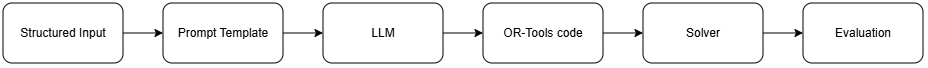
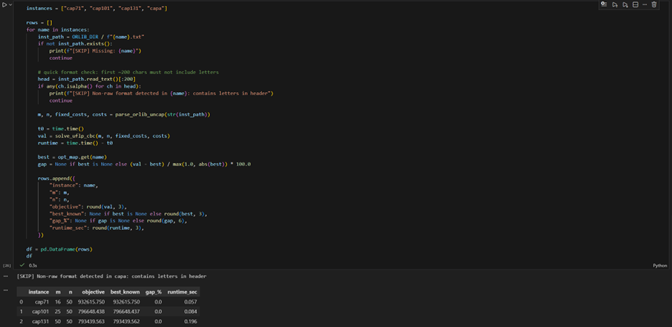

## AI-Assisted Symbolic Optimization for Strategic Facility Network Design

### Table of Contents

- [1 Framing the Business Idea as an ML Problem](#1-framing-the-business-idea-as-an-ml-problem)
  - [1.1 Business Case Description](#11-business-case-description)
  - [1.2 Business Value of Using ML](#12-business-value-of-using-ml)
  - [1.3 Data Overview](#13-data-overview)
  - [1.4 Project Archetype](#14-project-archetype)
  - [1.5 System Architecture Overview](#15-system-architecture-overview)
- [2 Feasibility Analysis](#2-feasibility-analysis)
  - [2.1 Literature Review](#21-literature-review)
  - [2.2 Baseline Model Specification](#22-baseline-model-specification)
  - [2.3 Metrics for Business and Research Evaluation](#223-metrics-for-business-and-research-evaluation)

---

### Quick Links

- **📄 [Full Report (PDF)](report_presentation/report.pdf)**
- **📊 [Presentation (PDF)](report_presentation/presentation.pdf)**
- **🎥 [Presentation Video (MP4)](report_presentation/presentation_video.mp4)**

---

## 1. Framing the Business Idea as an ML Problem

### 1.1 Business Case Description

#### 1.1.1 Context
Facility location decisions are among the most critical strategic planning problems in operations management. Organizations must determine which facilities to open and how to assign customers in order to minimize infrastructure and servicing costs while maintaining service-level guarantees.

In practice, the strategic bottleneck is often not solver performance but the time and expertise required to formalize the optimization model itself. In this project, business impact will be measured through quantifiable proxies such as:

- Modeling time reduction (minutes from instance load to first feasible model vs manual formulation),
- Manual intervention reduction (number of prompt edits or code patches required to reach feasibility),
- Iteration speed (time to modify and re-solve under new cost scenarios).

Applications include:

- E-commerce fulfillment networks
- Telecom base station placement
- EV charging station planning
- Cloud data center deployment
- Healthcare service network design

The Uncapacitated Facility Location Problem (UFLP) formalizes this decision as:

$$
\min_{y,x}\; \sum_{i\in F} f_i y_i + \sum_{i\in F}\sum_{j\in C} c_{ij} x_{ij}
$$

Subject to:

$$
\sum_{i\in F} x_{ij} = 1, \quad \forall j \in C
$$

$$
x_{ij} \le y_i, \quad \forall i\in F,\; j\in C
$$

$$
 y_i \in \{0,1\},\quad x_{ij} \in \{0,1\}
$$

UFLP is NP-hard and widely used as a benchmark in combinatorial optimization research [1](references/references.md).

#### 1.1.2 Core Business Pain Point

While modern solvers (CPLEX, Gurobi, OR-Tools) can efficiently solve UFLP once formulated, the formulation process itself requires expert knowledge in operations research and mathematical modeling.

This creates:

- Dependency on OR specialists
- High modeling cost
- Slow iteration cycles
- Increased risk of formulation errors
- Limited accessibility to non-experts

Importantly, in many enterprise contexts, the bottleneck is model formalization, not solving.

#### 1.1.3 Proposed Solution

We propose an AI-assisted modeling system in which a Large Language Model (LLM):

- Generates a formal symbolic optimization program from structured input
- Produces solver-compatible code (e.g., OR-Tools MILP formulation)
- Delegates solution computation to a classical solver
- Optionally refines the formulation iteratively based on solver feedback

This follows the LLMFP paradigm proposed by Hao et al. [2](references/references.md), where LLMs generate formalized programs that are executed and verified by external solvers. Unlike black-box LLM optimization methods (e.g., LEO-style evolutionary approaches [7](references/references.md)), our system uses LLMs strictly for model generation, while correctness and optimality are guaranteed by a classical solver.

### 1.2 Business Value of Using ML

The value proposition centers on modeling automation, not solver acceleration. The introduction of LLM-based symbolic optimization generation produces measurable business impact:

- Democratization of Optimization: Business analysts can generate models
- Reduced Human Error: Systematic constraint specification
- Faster Scenario Iteration: Rapid cost/structure changes
- Scalable Deployment: Reusable modeling pipelines

The LLM augments the modeling layer while preserving solver-grade rigor.

### 1.3 Data Overview

#### 1.3.1 Dataset Source and Provenance

We use the OR-Library benchmark suite curated by J. E. Beasley, a widely used public repository of standardized test instances for operations research problems.

Our instances come from OR-Library's Uncapacitated warehouse location collection, which correspond to standardized test sets commonly used in facility location research and distributed through the OR-Library repository [1](references/references.md).

This provenance is important for research rigor: the instances are not synthetic "toy" problems, but established benchmarks designed for algorithmic comparison.

#### 1.3.2 Benchmark Scope and Scale

The uncapacitated warehouse location collection contains 15 instance files:

- cap71 - cap74
- cap101 - cap104
- cap131 - cap134
- capa, capb, capc

Each instance provides:

- Facility count $m$
- Customer count $n$
- Fixed costs $f_i$
- Allocation costs $c_{ij}$

Instances span increasing levels of complexity. For example:

- cap71: $m=16$ facilities, $n=50$ customers

From a practical standpoint, the full collection is lightweight (3.7MB total), making it convenient for reproducible experiments and CI-style benchmarking.

These instances are widely used in modern metaheuristic research, including ABPEA [3](references/references.md) and hybrid GA+SA [4](references/references.md).

#### 1.3.3 Input Structure and Semantics

Each instance is provided as a plain text file with a fixed, machine-parsable structure:

- First line: $m$ (number of candidate facility/warehouse locations) and $n$ (number of customers).
- For each facility $i\in\{1,\dots,m\}$: a pair (capacity, fixed opening cost).
- For each customer $j\in\{1,\dots,n\}$: a demand value followed by $m$ allocation costs (shipping/service cost of assigning customer $j$ to facility $i$).

Although the files include capacities and demands due to their origin in capacitated variants, OR-Library explicitly states these quantities should be ignored for the uncapacitated version (UFLP).

Thus, the effective optimization input is:

- Fixed-cost vector $f_i$
- Allocation-cost matrix $c_{ij}$

#### 1.3.4 Output, Ground Truth, and Verifiability

A solution consists of:

- Binary facility-opening decisions $y_i\in\{0,1\}$
- Customer-to-facility assignments $x_{ij}\in\{0,1\}$
- And a total objective value

Crucially, OR-Library provides a companion file ([uncapopt.txt](../data/raw/uncapopt.txt)) [1](references/references.md) containing the known optimal objective value for each instance in this benchmark set (e.g., cap71 = 932615.750).

This enables:

- Exact optimality gap computation
- Feasibility verification
- Reproducible research-grade benchmarking

The availability of ground-truth optimal solutions is critical for evaluating correctness of LLM-generated symbolic models.

#### 1.3.5 Clickable repository artifacts

The repository contains the following clickable artifacts for convenience and reproducibility:

- **Data directory:** [data/raw/](../data/raw/)
- **Instance files:** [cap71.txt](../data/raw/cap71.txt), [cap72.txt](../data/raw/cap72.txt), [cap73.txt](../data/raw/cap73.txt), [cap74.txt](../data/raw/cap74.txt), [cap101.txt](../data/raw/cap101.txt), [cap102.txt](../data/raw/cap102.txt), [cap103.txt](../data/raw/cap103.txt), [cap104.txt](../data/raw/cap104.txt), [cap131.txt](../data/raw/cap131.txt), [cap132.txt](../data/raw/cap132.txt), [cap133.txt](../data/raw/cap133.txt), [cap134.txt](../data/raw/cap134.txt), [capa.txt](../data/raw/capa.txt), [capb.txt](../data/raw/capb.txt), [capc.txt](../data/raw/capc.txt)
- **Known optima:** [uncapopt.txt](../data/raw/uncapopt.txt)
- **Notebook:** [notebook/baseline_uflp_ortools.ipynb](notebook/baseline_uflp_ortools.ipynb)
- **Baseline script:** [baselines/solve_ulfp_ortools.py](baselines/solve_ulfp_ortools.py)

### 1.4 Project Archetype

This system can be formally categorized as an "LLM-as-modeler" architecture, where the LLM generates symbolic optimization programs while a classical solver performs execution and verification. It belongs to the following AI system archetypes:

- Neuro-Symbolic Optimization System: LLM generates symbolic representation ? classical solver executes.
- LLM-Augmented Decision Systems: LLM performs model construction rather than direct decision-making.
- Verification-Guided AI: Solver verifies feasibility and optimality.
- Code Generation for Optimization: Inspired by LLMFP methodology.

It differs from LLM-as-optimizer frameworks (e.g., LEO [7](references/references.md)) and heuristic ML acceleration methods. We use solver verification to guarantee correctness.

### 1.5 System Architecture Overview

Unlike learning-to-optimize approaches that directly construct solutions, our system separates symbolic generation from optimization execution.

Workflow:

1. Structured instance data are parsed from OR-Library.
2. A constrained prompt template encodes the problem specification.
3. The LLM generates solver-compatible OR-Tools code (symbolic MILP model).
4. The generated code is executed in an automated environment.
5. A classical solver computes the solution.
6. Results are evaluated against the known optimal objective values ([uncapopt.txt](../data/raw/uncapopt.txt)).

This verification-guided architecture ensures that correctness is enforced by the solver rather than assumed from natural language reasoning.

*Figure 1: End-to-end architecture of the proposed LLM-assisted symbolic optimization pipeline for UFLP*

## 2. Feasibility Analysis

### 2.1 Literature Review

#### 2.1.1 Classical Facility Location Optimization

The Uncapacitated Facility Location Problem (UFLP) is one of the most extensively studied combinatorial optimization problems in operations research. The problem seeks to determine which facilities to open and how to assign customers to minimize total fixed and assignment costs. UFLP is NP-hard and has served as a canonical benchmark for evaluating exact, approximation, and metaheuristic methods.

Early research focused on exact MILP methods solvable using branch-and-bound and branch-and-cut frameworks. The OR-Library benchmark instances introduced by Beasley remain widely used to evaluate algorithmic performance due to their standardized structure and known optimal objective values. Recent OR-Library results include ABPEA (2023) [3](references/references.md) and a Hybrid Genetic Algorithm with Simulated Annealing (2025) [4](references/references.md).

Despite algorithmic advances, a fundamental assumption persists across the literature: the optimization model must be manually formalized by domain experts prior to solving. The modeling layer is treated as external to the solution process. Thus, while solver performance has improved significantly, automation of formal model generation has not been a central focus of traditional UFLP research.

#### 2.1.2 Machine Learning for Combinatorial Optimization

Recent years have witnessed increased interest in applying machine learning to combinatorial optimization problems. Approaches include learning heuristics or branching strategies, neural combinatorial optimization, policy-gradient methods for solution construction, and learning-based parameter tuning.

However, a key limitation of this research direction is that it primarily targets solution quality or speed, not the formal construction of optimization models. The underlying assumption remains that a correct mathematical formulation is already available.

In contrast, the bottleneck in many enterprise applications lies not in solver speed but in model formalization, validation, and iterative specification. This gap motivates investigation into AI systems capable of generating formal optimization programs automatically.

#### 2.1.3 LLM-Based Symbolic Planning and Optimization

Recent advances in Large Language Models (LLMs) have demonstrated strong capabilities in code generation and structured reasoning. Of particular relevance is the LLMFP paradigm (Planning Anything with Rigor) which proposes a hybrid framework where the LLM generates a formal symbolic program, a solver executes it, and verification/refinement loops ensure correctness [2](references/references.md).

Related works in LLM-assisted planning similarly employ structured intermediate representations such as PDDL or SMT constraints, demonstrating that LLMs perform more reliably when generating formal artifacts rather than final solutions.

However, existing research largely evaluates these systems on toy planning tasks, logic puzzles, or synthetic reasoning benchmarks. There is limited systematic evaluation on classical operations research benchmarks with known optimal solutions.

Recent works such as LEO (Large Language Models as Evolutionary Optimizers) [7](references/references.md) and studies examining LLMs for optimization [8](references/references.md) explore using LLMs directly as search or optimization agents. In contrast, our approach does not position the LLM as an optimizer. Instead, the LLM is restricted to generating formal symbolic models that are executed and verified by a classical solver, ensuring correctness through external validation rather than probabilistic reasoning.

#### 2.1.4 Identified Research Gap

Based on the above review, we identify a clear research gap:

- Classical UFLP literature focuses on solution algorithms, not model generation.
- ML for combinatorial optimization primarily improves heuristics, not symbolic modeling.
- LLM-based planning research has not been systematically evaluated on OR-Library facility location benchmarks with exact optimality comparison.

To the best of our knowledge, no prior work evaluates an LLM-generated symbolic optimization pipeline on OR-Library UFLP instances with exact optimal objective benchmarking. This project therefore contributes:

A systematic evaluation of LLM-generated formal optimization models for UFLP, validated against classical OR benchmarks with known optimal solutions.

## 2.2 Baseline Model Specification

To ensure scientific rigor and reproducibility, we establish a deterministic optimization baseline before introducing any LLM-based generation. This baseline serves as a verified reference implementation of UFLP, enabling later experiments to attribute performance differences to the modeling layer (LLM-generated MILP code) rather than solver behavior or data ingestion errors.

### 2.2.1 Deterministic Baseline: OR-Library Parser + OR-Tools MILP (CBC)

Baseline objective:

Implement the canonical UFLP MILP formulation and validate it on OR-Library instances using the published optimal objective values in [uncapopt.txt](../data/raw/uncapopt.txt) [1](references/references.md). This provides a ground-truth reference for correctness and optimality-gap computation.

Implementation components (reproducible notebook baseline):

The baseline is implemented in a Jupyter notebook (and mirrored in a Python script) with three key modules:

1. Instance ingestion (OR-Library parsing): The notebook parses OR-Library uncapacitated warehouse location instances by extracting fixed opening costs $f_i$ (capacity ignored) and assignment costs $c_{ij}$ (demand ignored).
2. Optimal value lookup: A small parser loads [uncapopt.txt](data/raw/uncapopt.txt) and maps each instance name (e.g., cap71) to its known optimal objective value, enabling exact gap computation.
3. Canonical MILP formulation in OR-Tools (CBC backend).

Decision variables:

- $y_i\in\{0,1\}$ : facility opening decision
- $x_{ij}\in\{0,1\}$ : customer assignment decision

Objective:

$$
\min_{y,x}\; \sum_{i\in F} f_i y_i + \sum_{i\in F}\sum_{j\in C} c_{ij} x_{ij}
$$

Constraints:

Each customer assigned exactly once:

$$
\sum_{i\in F} x_{ij} = 1, \quad \forall j\in C
$$

Assignment only to open facilities:

$$
x_{ij} \le y_i, \quad \forall i\in F\; j\in C
$$

Validation results (notebook execution):

We validated the baseline on three OR-Library instances of increasing facility count. The solver matched the known optimal objective values with 0.0% gap.

*Figure 2: Baseline notebook execution snapshot.*

The summary table below shows an excerpt of deterministic baseline results (also available as a standalone file in the repository):

| Instance | m | n | Solver objective | Best known | Gap (%) | Runtime (s) |
|---|---:|---:|---:|---:|---:|---:|
| cap71  | 16 | 50 | 932615.750 | 932615.750 | 0.0 | 0.057 |
| cap101 | 25 | 50 | 796648.438 | 796648.437 | 0.0 | 0.084 |
| cap131 | 50 | 50 | 793439.563 | 793439.562 | 0.0 | 0.196 |

Table 1: Deterministic baseline validation on OR-Library UFLP instances. The OR-Tools (CBC) MILP baseline matches the published best-known optimal objective values in `uncapopt.txt` with 0.0% optimality gap across increasing facility counts.

These results confirm:

- correct OR-Library parsing,
- correct MILP formulation,
- reliable solver configuration,
- a sound benchmark evaluation protocol using OR-Library ground truth [1](references/references.md).

Repository assets:

- Notebook baseline (reproducible execution): [notebook/baseline_uflp_ortools.ipynb](notebook/baseline_uflp_ortools.ipynb)
- Raw OR-Library instances + optimal values: [data/raw/](data/raw/) (cap*.txt, [uncapopt.txt](data/raw/uncapopt.txt))

Because the baseline is a deterministic optimization solver rather than a learned statistical model, the "trained binary + retraining notebook" requirement is interpreted in terms of reproducibility. Instead of model retraining, reproducibility is ensured via a Jupyter notebook that regenerates all results directly from raw OR-Library data, guaranteeing transparent and deterministic verification.

### 2.2.2 Proposed LLM-Augmented Model

The proposed system replaces manual model construction with LLM-generated symbolic optimization code while preserving solver-level verification. The pipeline is:

1. Parse structured instance data from OR-Library
2. Provide a constrained prompt template specifying UFLP structure and output format
3. LLM generates OR-Tools compatible MILP code
4. Execute generated code automatically
5. Compare objective against OR-Library optimum to compute exact gap and feasibility metrics

An optional future extension is an iterative repair loop where solver errors or constraint violations are returned to the LLM for correction, consistent with solver-in-the-loop formal verification paradigms [2](references/references.md), [6](references/references.md).

### 2.2.3 Metrics for Business and Research Evaluation

Evaluation must capture both technical optimization performance and business transformation impact.

Technical Metrics

- Optimality Gap (%): $\frac{\text{Solver Objective} - \text{Best Known}}{\text{Best Known}} \times 100$
- Feasibility Rate: percentage of instances producing valid constraint-satisfying solutions.
- Code Execution Success Rate: percentage of LLM-generated models that run without runtime errors.
- Constraint Satisfaction Rate: post-solve verification of all constraints.
- Solver Runtime: wall-clock time in seconds.

Business-Oriented Metrics

- Modeling Time Reduction: minutes from instance load to first feasible solution (manual vs LLM-generated).
- Manual Intervention Reduction: number of prompt revisions or code edits required to achieve feasibility.
- Scenario Iteration Speed: time required to modify parameters and regenerate a valid model.
- Scalability Across Instances: consistency of model generation across increasing instance sizes.

Research Metrics

- Generalization Across Instances: performance on unseen OR-Library instances.
- Prompt Stability: variation in gap or feasibility across multiple runs with identical prompts.
- Reproducibility: ability to regenerate identical results using the provided notebook and raw data.

The availability of exact optimal objective values in OR-Library enables strict quantitative benchmarking, strengthening the scientific validity of the study.

---

## Works Cited

See [references.md](references/references.md) for full bibliographic entries and links.

---

Figures and tables:

- [assets/images/figure1.png](assets/images/figure1.png) – pipeline diagram
- [assets/images/figure2.png](assets/images/figure2.png) – baseline snapshot
- [assets/table1.md](assets/table1.md) – baseline results table